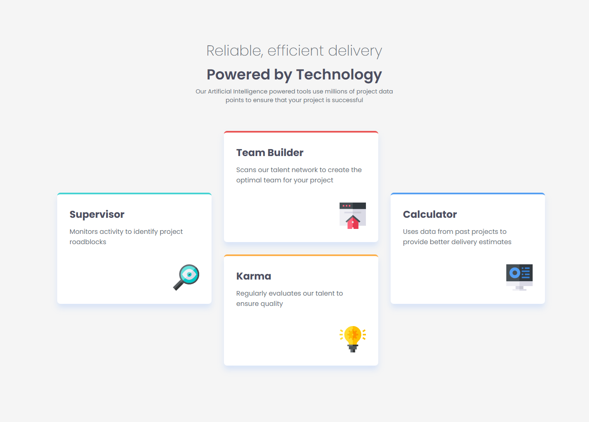
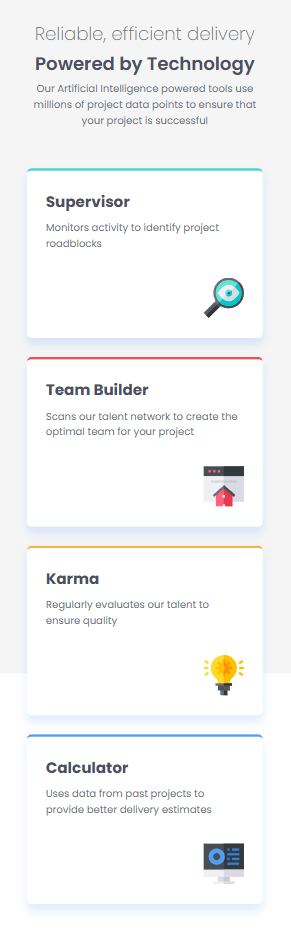

# Frontend Mentor - Four card feature section solution

This is a solution to the [Four card feature section challenge on Frontend Mentor](https://www.frontendmentor.io/challenges/four-card-feature-section-weK1eFYK). Frontend Mentor challenges help you improve your coding skills by building realistic projects.

## Table of contents

- [Overview](#overview)
  - [The challenge](#the-challenge)
  - [Screenshot](#screenshot)
  - [Links](#links)
- [My process](#my-process)
  - [Built with](#built-with)
  - [What I learned](#what-i-learned)

## Overview

### The challenge

Users should be able to:

- View the optimal layout for the site depending on their device's screen size

### Screenshot




### Links

- Solution URL: [Add solution URL here](https://github.com/tortiman/four_card_feature_section/)
- Live Site URL: [Add live site URL here](https://tortiman.github.io/four_card_feature_section/)

## My process

### Built with

- CSS custom properties
- Flexbox
- CSS Grid
- Mobile-first workflow

### What I learned

I learned aboud the configuration about grid propierties in CSS.

```html
<div class="diapositivas">
  <div class="card supervisor">
    <h3>Supervisor</h3>
    <p>Monitors activity to identify project roadblocks</p>
    
  </div>
  <div class="card team-builder">
    <h3>Team Builder</h3>
    <p>Scans our talent network to create the optimal team for your project</p>
    
  </div>
  <div class="card karma">
    <h3>Karma</h3>
    <p>Regularly evaluates our talent to ensure quality</p>
    
  </div>
  <div class="card calculator">
    <h3>Calculator</h3>
    <p>Uses data from past projects to provide better delivery estimates</p>
    
  </div>
</div>
```

```css
.diapositivas {
  display: grid;
  width: 80%;
  grid-template-columns: repeat(3, 1fr); /* 3 columnas de igual ancho */
  grid-template-rows: repeat(2, auto); /* 2 filas de altura automática */
  gap: 30px; /* Espacio entre las tarjetas */
  align-items: center; /* ¡Clave! Centra verticalmente las tarjetas que ocupan más de una fila */
  justify-items: center;
  margin-top: 4em;
}

.supervisor,
.team-builder,
.karma,
.calculator {
  width: 375px;
  height: 270px;
  background-color: var(--WhiteNeutral);
}

.supervisor {
  border-top: 4px solid var(--CyanPrimary); /* Verde azulado */
  grid-column: 1 / 2;
  grid-row: 1 / 3; /* Ocupa desde la fila 1 hasta la 3 */
}

.karma {
  border-top: 4px solid var(--OrangePrimary); /* Verde azulado */
  grid-column: 2 / 2;
  grid-row: 2 / 2; /* Ocupa desde la fila 1 hasta la 3 */
}

.team-builder {
  border-top: 4px solid var(--RedPrimay);
  grid-column: 2 / 2;
  grid-row: 1 / 2; /* Ocupa desde la fila 1 hasta la 3 */
}

.calculator {
  border-top: 4px solid var(--BluePrimary);
  grid-column: 3 / 3;
  grid-row: 1 / 3;
}
.card .img {
  align-self: flex-end;
  margin-top: 40px;
  width: 64px;
  height: 64px;
}

.card h3 {
  margin-top: 0;
  margin-bottom: 10px;
  font-size: 1.5em;
  color: var(--GreyNeutral500);
}

.card p {
  margin: 0;
  font-size: 1em;
  color: var(--GreyNeutral400);
}
```
